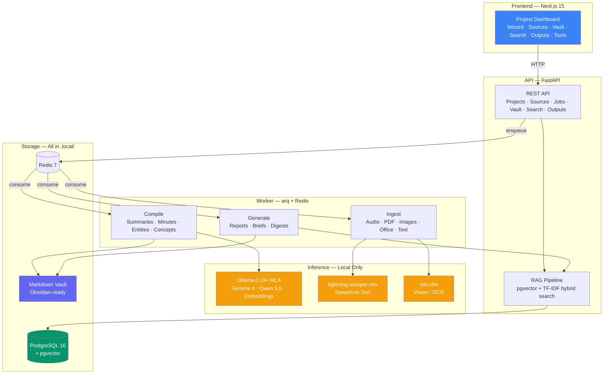

# The Consultant

An edge-first knowledge compiler for consultants. Record meetings, upload documents, and get a structured Markdown vault with meeting minutes, summaries, action items, and client-ready reports. All inference runs locally — zero data leaves your machine.

## The Problem

You finish a client meeting. You have a recording, a whiteboard photo, three PDFs they shared, and scattered notes. Now what?

Most tools either trap your knowledge in a chat window, require cloud APIs that leak client data, or need you to manually organize everything. After 8 weeks on a project you have hundreds of files and no structure.

## What The Consultant Does

You create a project, drop in your files, and the pipeline compiles everything into a searchable, linked knowledge vault:

```
Meeting audio (.m4a)  ──► Whisper transcription (EN→ES, ES→ES)
Whiteboard photo      ──► Vision OCR (tables, handwriting)  
PDF reports           ──► Text extraction + metadata         ──► Compiled Vault
Word/Excel/PowerPoint ──► Structure-aware extraction              │
Markdown notes        ──► Direct passthrough                      │
                                                                   ▼
                                                          Meeting minutes
                                                          Entity profiles
                                                          Decision log
                                                          Action items
                                                          Concept articles
                                                          Status reports
                                                          Searchable answers
```

**20-minute audio transcribed in ~24 seconds** on Mac M2. English meetings → Spanish notes? Automatic.

## Edge-First: Everything Runs Locally

No OpenAI. No Anthropic. No cloud APIs. The entire inference stack runs on your machine:

| Task | Backend | Speed |
|------|---------|-------|
| LLM synthesis | Ollama 0.19+ (MLX) — Gemma 4, Qwen 3.5 | Near-native on Apple Silicon |
| Transcription | lightning-whisper-mlx | 10x faster than whisper.cpp |
| OCR / Vision | mlx-vlm — Gemma 4 vision | Documents, whiteboards, tables |
| Embeddings | Ollama — nomic-embed-text | Semantic search via pgvector |
| Vector DB | PostgreSQL + pgvector | HNSW index, <50ms queries |

Models load **sequentially** — one at a time. A 32GB Mac runs the full pipeline including 27B parameter models.

All models and data live in `.local/` inside the project directory. Move the folder, everything comes with it. Delete `.local/`, reclaim all disk space.

## Consultant Workflow

```
Week 1:  Create project → upload proposals, contracts
         First compile → vault has initial entities + summaries

Week 2:  Record meeting #1 → upload audio + whiteboard photos
         Re-compile → meeting minutes, new entities, cross-references

Week 3:  Generate weekly digest for client
         DeerFlow: "Research competitor pricing from vault"

Week 4:  Generate status report
         MiroFish: "What if budget cuts by 15%?"

Week 8:  Generate final project brief
         Export vault as ZIP for Obsidian archive
```

## What Gets Generated

### Automatic (on every compile)

| Output | From |
|--------|------|
| Timestamped transcript | Audio files |
| Meeting minutes (attendees, decisions, action items) | Audio transcripts |
| Executive summary | Any source |
| Entity profiles (people, companies, projects) | Cross-source extraction |
| Decision log | All meetings |
| Action item tracker (owner, deadline, status) | All meetings |
| Reference list / bibliography | Academic/technical docs |
| Concept articles | Cross-source synthesis |
| Contradiction report | Conflicting info across sources |

### On-demand (you request via UI)

| Output | Purpose |
|--------|---------|
| Project status report | Executive overview with risks and next steps |
| Client brief | Polished 1-2 page for delivery |
| Weekly digest | What happened this week |
| Risk register | Likelihood / impact / mitigation table |
| RACI matrix | Responsibility assignment |
| Follow-up email | Post-meeting with action items |
| Mermaid diagram | Architecture, flows, timelines |
| Custom prompt | Any question grounded in vault knowledge |

## Built-in Research & Simulation Tools

| Tool | What it does | Runs on |
|------|-------------|---------|
| **DeerFlow** | Multi-step research against your vault — decomposes questions, searches, synthesizes | Gemma 4 26B (MoE) |
| **Hermes** | Session memory — remembers what you were working on last time | Gemma 4 (e4b) + Redis |
| **MiroFish** | What-if simulation — "What if we delay launch by 4 weeks?" | Qwen 3.5 (deep reasoning) |

All three run locally against Ollama + vault RAG. No cloud calls.

## Architecture



## Quick Start

### Prerequisites

- Mac with Apple Silicon (M1+), 16GB+ RAM (32GB recommended)
- [Ollama](https://ollama.com) installed
- Node.js 20+, pnpm 9+
- Python 3.12+, [uv](https://docs.astral.sh/uv/)
- Docker & Docker Compose

### One-command setup

```bash
./scripts/setup.sh
```

This downloads all models into `.local/`, installs dependencies, and pulls Docker images. Takes ~15 min on first run (mostly model downloads). After this, **no internet required**.

### Start

```bash
./scripts/start.sh
```

Opens at [http://localhost:3000/projects](http://localhost:3000/projects)

### Verify offline mode

```bash
# Disconnect WiFi, then:
./scripts/verify-offline.sh
./scripts/start.sh
# Everything works.
```

### Run tests

```bash
cd services/worker && uv run pytest tests/    # 316 tests
pnpm turbo run build --filter=@atlas/web      # frontend build check
```

## Supported File Types

| Format | Extensions | Extractor |
|--------|-----------|-----------|
| Audio | `.mp3, .wav, .m4a, .ogg, .webm` | lightning-whisper-mlx (local) |
| PDF | `.pdf` | pdfplumber |
| Images | `.jpg, .png, .webp, .tiff` | mlx-vlm Gemma 4 vision (local) |
| Word | `.docx` | python-docx |
| Excel | `.xlsx, .csv` | openpyxl |
| PowerPoint | `.pptx` | python-pptx |
| Markdown | `.md` | passthrough |
| Plain text | `.txt` | passthrough |
| HTML | `.html, .htm` | BeautifulSoup4 |

## Model Profiles

Choose based on your hardware:

| Profile | RAM | Synthesis Model | Best For |
|---------|-----|----------------|----------|
| `light` | 16GB | Gemma 4 (e4b) | Quick extraction, basic summaries |
| `standard` | 32GB | Gemma 4 26B (MoE) | Full pipeline — **recommended** |
| `reasoning` | 32GB+ | Qwen 3.5 27B Claude-distilled | Deep analysis, simulations |
| `polyglot` | 32GB | Qwen 3 30B (100+ languages) | Multi-language projects |
| `maximum` | 64GB+ | Qwen 2.5 72B | No compromises |

Set via `MODEL_PROFILE=standard` in `.env`.

## Project Structure

```
apps/web/                   Next.js 15 frontend (projects, vault, search, outputs, tools)
services/api/               FastAPI backend (routes, search, adapters, evals)
services/worker/            arq workers (ingest, compiler, outputs, health)
  inference/                Inference Router + backends (Ollama, Whisper MLX, Vision MLX)
  extractors/               Audio, OCR, PDF, HTML, Word, Excel, PowerPoint, Text
  compiler/                 Summarizer, meeting minutes, entities, concepts, tracker, translator
  search/                   PgVectorStore, IncrementalEmbedder, RAGPipeline
packages/shared/            TypeScript domain types (branded IDs, enums)
vault/                      Compiled Markdown vault (Obsidian-compatible)
scripts/                    setup.sh, start.sh, verify-offline.sh
.local/                     Models, data, uploads (gitignored, self-contained)
docs/                       Design specs, roadmap, implementation playbooks
```

## Design Decisions

| Decision | Rationale |
|----------|-----------|
| Edge-first, no cloud APIs | Client data stays on your machine |
| Ollama + MLX hybrid | Best model management (Ollama) + best Mac performance (MLX) |
| Sequential model loading | One model in RAM at a time — 32GB runs 27B models |
| pgvector in PostgreSQL | Vector search + metadata JOINs in one query, no extra service |
| Markdown vault as product | Portable, Obsidian-compatible, survives the app |
| `.local/` self-containment | Move folder = move everything. Delete = clean slate |
| Deterministic pipeline + opt-in LLM | Reproducible base, synthesis where it adds value |
| Frozen dataclasses everywhere | Immutable domain objects prevent hidden mutation |
| RAG for all generated outputs | Every report grounded in vault knowledge, never hallucinated |

## Language Support

- **Transcription**: 99 languages (Whisper large-v3)
- **EN→ES workflow**: Whisper transcribes English → LLM translates to Spanish (highest accuracy)
- **ES→ES workflow**: Whisper with `language="es"` direct
- **Synthesis**: Gemma 4 and Qwen models handle English + Spanish natively

## Roadmap

See [docs/15-edge-first-roadmap.md](docs/15-edge-first-roadmap.md) for the full implementation plan.

| Phase | Status |
|-------|--------|
| Phase 0: Inference Router | Done |
| Phase 0.5: Offline Setup | Done |
| Phase 1: Extractors (audio, OCR, Office) | Done |
| Phase 2: LLM Compilation | Done |
| Phase 3: Project UX | Done |
| Phase 4: RAG + pgvector | Done |
| Phase 5: Model Management UI | Planned |
| Phase 6: Polish + Onboarding | Planned |
| Phase 7: Mobile Companion (Google AI Edge) | Future |

## License

Apache 2.0
