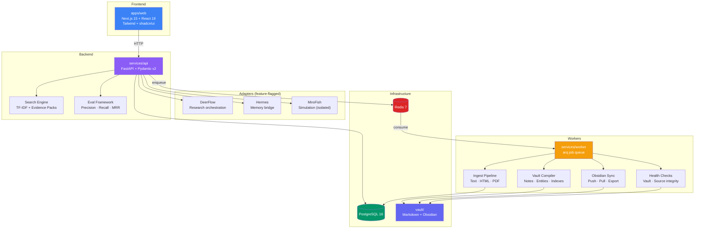
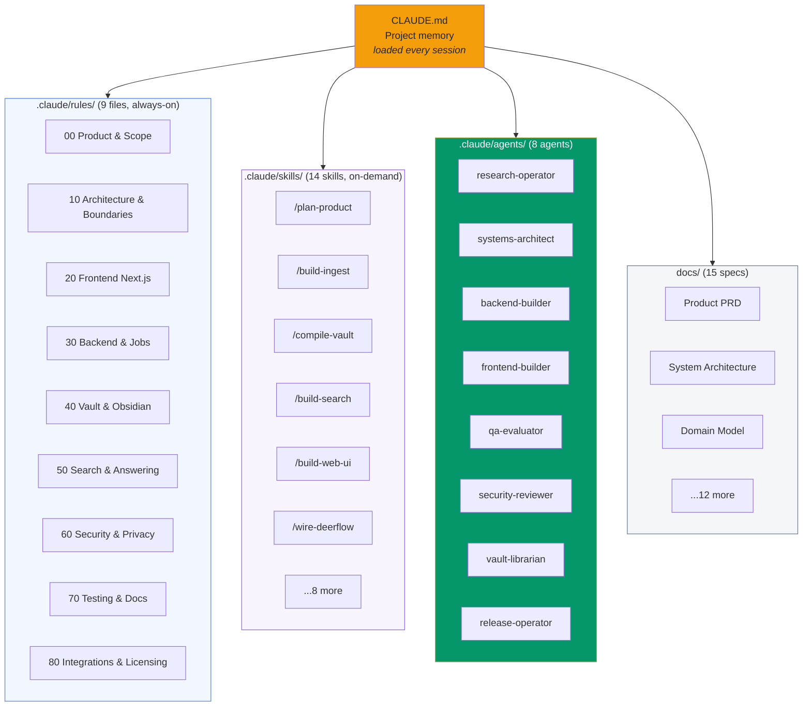

# Project Atlas

**A production-grade Claude Code instruction set that builds an entire full-stack application from scratch.**

This repository contains ~19,000 lines of structured instructions (rules, skills, agents, specs) that guide Claude Code to generate a complete knowledge compiler application — 16,000+ lines of working code with 373 passing tests — using agent teams with zero manual coding.

## Why Use This Repo

### The problem

Starting a Claude Code project from `CLAUDE.md` alone is like giving an architect a sticky note and expecting blueprints. You get generic code, inconsistent patterns, and constant hand-holding.

### What this repo provides

A **complete instruction architecture** that turns Claude Code into a disciplined engineering team:

```
19,169 lines of instructions  -->  Claude Code Agent Teams  -->  16,338 lines of working code
     47 instruction files                4 teams, 15 agents            373 passing tests
```

| What you get | Why it matters |
|---|---|
| **9 domain rule files** with path-scoping | Claude applies the right constraints to the right files automatically |
| **14 reusable skills** (slash commands) | Complex workflows like `/build-ingest` or `/compile-vault` run as repeatable procedures |
| **8 specialized agents** | Research, architecture, backend, frontend, QA, security, vault, and release agents collaborate in parallel |
| **15 design documents** | Product spec, architecture, domain model, and implementation playbook give Claude deep domain context |
| **A working reference app** | Not a toy TODO app — a real knowledge compiler with ingest, compilation, search, and a web UI |

### Key advantages over a bare CLAUDE.md

1. **Consistent architecture across sessions.** Rules are path-scoped and always loaded. Claude doesn't "forget" your patterns between conversations.

2. **Parallel agent execution.** Instead of one Claude doing everything sequentially, agent teams split work across 3-5 agents working simultaneously — the entire app was built in 4 team waves.

3. **Skill-based workflows.** Instead of writing "implement the ingest pipeline" and hoping for the best, `/build-ingest` provides a structured 7-step procedure with acceptance criteria.

4. **Layered instruction hierarchy.** `CLAUDE.md` (concise) > `.claude/rules/` (always-on) > `.claude/skills/` (on-demand) > `docs/` (deep reference). Claude loads what it needs, when it needs it.

5. **Domain-aware constraints.** Rules like "never silently change stable vault paths" or "every generated artifact must record provenance" are enforced automatically — not by hope.

6. **Fully adaptable.** Swap the domain (knowledge compiler -> anything else), keep the instruction architecture.

## Architecture



### Data Flow: Source to Searchable Vault

```mermaid
flowchart LR
    UPLOAD["Upload<br/>text / HTML / PDF"] --> EXTRACT["Extract<br/>content + metadata"]
    EXTRACT --> CHUNK["Chunk<br/>+ SHA-256 hash"]
    CHUNK --> STORE["Store<br/>raw + manifest"]
    STORE --> COMPILE["Compile<br/>source notes"]
    COMPILE --> ENTITIES["Extract<br/>entities (NER)"]
    ENTITIES --> INDEX["Generate<br/>indexes + backlinks"]
    INDEX --> VAULT["Markdown Vault<br/>Obsidian-ready"]
    VAULT --> SEARCH["TF-IDF Index<br/>+ evidence packs"]
    SEARCH --> CITE["Citation-backed<br/>answers"]

    style UPLOAD fill:#e2e8f0,color:#1e293b
    style VAULT fill:#6366f1,color:#fff
    style CITE fill:#059669,color:#fff
```



## Claude Code Instruction Architecture



### How the build was executed

The entire application was generated in **4 sequential agent team waves**:

| Team | Agents | Phases | Output |
|------|--------|--------|--------|
| `atlas-bootstrap` | 5 | 0+1: Monorepo + Domain Models | Scaffold, types, DB migrations, API stubs |
| `atlas-pipeline` | 4 | 2+3: Ingest + Compiler | Extractors, chunking, vault notes, entity extraction |
| `atlas-search-ui` | 3 | 4+5: Search + Web UI | TF-IDF engine, evidence packs, full dashboard |
| `atlas-integrations` | 3 | 6-9: Sync + Adapters + Ops | Obsidian sync, adapters, health checks, eval framework |

**Total: 15 agents across 4 teams, 9 implementation phases, 6 commits.**

## Quick Start

### Prerequisites

- Node.js 20+, pnpm 9+
- Python 3.12+, [uv](https://docs.astral.sh/uv/)
- Docker & Docker Compose

### 1. Start infrastructure

```bash
docker compose up -d
```

### 2. Install dependencies

```bash
# JavaScript packages
pnpm install

# Python services
cd services/api && uv sync && cd ../..
cd services/worker && uv sync && cd ../..
```

### 3. Run database migrations

```bash
cd services/api
uv run alembic upgrade head
```

### 4. Start services

```bash
# API server (port 8000)
cd services/api && uv run uvicorn atlas_api.main:app --reload

# Worker
cd services/worker && uv run python -m atlas_worker.main

# Web UI (port 3000)
pnpm --filter @atlas/web dev
```

### 5. Run tests

```bash
# All JavaScript tests (shared + web)
pnpm test

# API tests
cd services/api && uv run pytest tests/

# Worker tests
cd services/worker && uv run pytest tests/
```

## Generated Application Features

### Source Ingestion
Upload text, HTML, or PDF files. The ingest pipeline extracts content, chunks it, computes SHA-256 hashes, and stores manifests for deduplication.

### Vault Compiler
Generates Obsidian-compatible Markdown notes from ingested sources:
- **Source notes** with full YAML frontmatter and provenance
- **Entity extraction** (heuristic NER: proper nouns, @mentions, URLs, emails)
- **Index generation** (sources, entities, tags)
- **Backlink verification** across `[[wikilinks]]`
- **Conflict detection** that preserves user edits

### Search & Evidence
- TF-IDF lexical search over vault notes
- Evidence pack assembly with citation-backed passages
- Footnote-style Markdown citations

### Web Dashboard
- Sources management (upload, list, detail view)
- Vault browser (Markdown reader with wikilink rendering)
- Search interface with evidence panel
- Jobs monitor with auto-refresh and recompile action

### Integration Adapters
All adapters follow a Protocol pattern and are feature-flagged:

| Adapter | Purpose | Env var |
|---------|---------|---------|
| DeerFlow | Research orchestration | `ATLAS_DEERFLOW_ENABLED` |
| Hermes | Cross-session memory bridge | `ATLAS_HERMES_ENABLED` |
| MiroFish | Scenario simulation (isolated) | `ATLAS_MIROFISH_ENABLED` |

### Health & Observability
- Vault integrity checks (broken links, missing frontmatter, stale/orphan/duplicate notes)
- Source health monitoring
- Search eval framework (precision@k, recall@k, MRR)
- Liveness (`/health`) and readiness (`/health/ready`) probes

## Project Structure

```
.
├── CLAUDE.md                   # Project memory (loaded every session)
├── .claude/
│   ├── rules/                  # 9 domain rule files (path-scoped, always-on)
│   ├── skills/                 # 14 reusable workflows (slash commands)
│   └── agents/                 # 8 specialized subagents
├── docs/                       # 15 design specs and playbooks
├── apps/
│   └── web/                    # Next.js 15 frontend
│       ├── app/(dashboard)/    # Dashboard routes
│       └── components/         # UI components (shadcn/ui)
├── services/
│   ├── api/                    # FastAPI backend
│   │   ├── src/atlas_api/
│   │   │   ├── adapters/       # DeerFlow, Hermes, MiroFish
│   │   │   ├── evals/          # Search & compiler eval framework
│   │   │   ├── models/         # Pydantic v2 domain models
│   │   │   ├── routes/         # API endpoints
│   │   │   ├── schemas/        # SQLAlchemy ORM models
│   │   │   └── search/         # TF-IDF indexer, query, evidence
│   │   ├── alembic/            # Database migrations
│   │   └── tests/
│   └── worker/                 # arq job queue
│       ├── src/atlas_worker/
│       │   ├── compiler/       # Vault compiler pipeline
│       │   ├── extractors/     # Text, HTML, PDF extractors
│       │   ├── health/         # Vault & source health checks
│       │   ├── jobs/           # Ingest & compile jobs
│       │   └── sync/           # Obsidian sync & export
│       └── tests/
├── packages/
│   └── shared/                 # TypeScript domain types
├── vault/                      # Sample Obsidian vault
├── docker-compose.yml          # PostgreSQL 16 + Redis 7
└── turbo.json                  # Monorepo task runner
```

## API Endpoints

| Method | Path | Description |
|--------|------|-------------|
| GET | `/health` | Liveness probe |
| GET | `/health/ready` | Readiness probe (DB check) |
| POST | `/workspaces` | Create workspace |
| GET | `/workspaces` | List workspaces |
| GET | `/sources` | List sources |
| POST | `/sources` | Create source metadata |
| POST | `/sources/{id}/upload` | Upload file + enqueue ingest |
| GET | `/jobs` | List jobs |
| GET | `/search?q=&limit=` | Search vault notes |
| POST | `/search/reindex` | Rebuild search index |
| POST | `/evidence` | Build evidence pack |
| GET | `/vault/notes` | List vault notes |
| GET | `/vault/notes/{slug}` | Read vault note |
| GET | `/vault/graph` | Wikilink graph |
| POST | `/export` | Export vault as ZIP |

## Test Coverage

**373 tests passing** across all packages:

| Package | Tests | Scope |
|---------|-------|-------|
| `services/api` | 162 passed | Search, vault, adapters, evals, health |
| `services/worker` | 130 passed | Extractors, compiler, ingest, sync, health |
| `apps/web` | 72 passed | Components, pages |
| `packages/shared` | 9 passed | Branded ID type guards |

## Adapting This For Your Own Project

1. **Fork this repo.**
2. **Replace the domain.** Swap "knowledge compiler" for your domain in `CLAUDE.md`, `docs/`, and `.claude/rules/`. The instruction architecture (rules, skills, agents) stays the same.
3. **Adjust the stack.** The rules reference Next.js + FastAPI + PostgreSQL. If your stack differs, update the relevant rule files.
4. **Keep the layering.** The hierarchy `CLAUDE.md` > `rules/` > `skills/` > `docs/` works for any complex project. Don't flatten everything into `CLAUDE.md`.
5. **Run agent teams.** Use Claude Code's `TeamCreate` / `Agent` tools to parallelize implementation, following the same phased approach.

## Design Principles

- **Vault-first** — The Markdown vault is a first-class product artifact, not an export side effect
- **Provenance** — Every generated artifact records source coverage, generation time, and confidence
- **Deterministic pipelines** — Ingest, compilation, and indexing are deterministic; LLM judgment is used only where synthesis is the point
- **Immutable data** — Frozen Pydantic models, readonly TypeScript interfaces
- **Replaceable adapters** — Protocol-based adapters behind feature flags
- **Idempotent jobs** — All jobs are retry-safe with deduplication

## Stats

| Metric | Value |
|--------|-------|
| Instruction files | 47 (rules, skills, agents, specs) |
| Lines of instructions | 19,169 |
| Generated Python code | 11,751 lines |
| Generated TypeScript code | 4,587 lines |
| Test code | 5,256 lines |
| Passing tests | 373 |
| Agent teams used | 4 |
| Total agents spawned | 15 |
| Git commits | 6 |

## License

MIT
