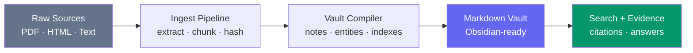
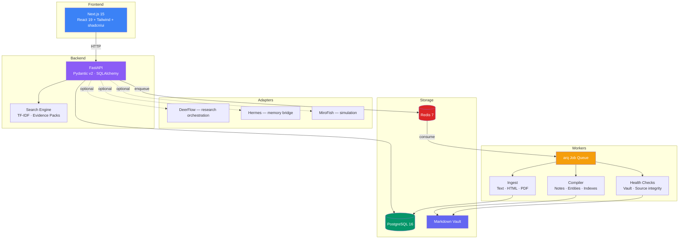

# Project Atlas

A knowledge compiler that turns raw sources into a living Markdown wiki, searchable answers, reusable outputs, and scenario simulations.

Not a chat-over-docs toy. A **compiler** — deterministic pipelines that ingest raw material, extract structure, and produce a portable knowledge vault you actually own.

## What It Does

You feed it documents. It gives you back a linked knowledge base.



**Input:** Any text, HTML, or PDF document.

**Output:**
- A Markdown vault with source notes, entity profiles, indexes, and backlinks — browsable in [Obsidian](https://obsidian.md)
- A search engine that returns citation-backed evidence packs, not hallucinated summaries
- Reusable exports (ZIP, sync) that preserve provenance and file stability

### The vault is the product

The compiled Markdown vault is not a side effect or an export option. It's the primary artifact:

- Every note has YAML frontmatter with source tracing, timestamps, and tags
- Entities are cross-referenced with `[[wikilinks]]` that Obsidian resolves natively
- Indexes rebuild automatically — sources, entities, tags — always current
- User edits are preserved: the compiler detects conflicts and never overwrites manual work
- Backlinks are verified: broken `[[links]]` surface as health check errors, not silent failures

### Search returns evidence, not guesses

When you search, you don't get "based on your documents, here's what I think." You get:

- **Ranked results** with TF-IDF scoring across your vault
- **Evidence packs** — the actual passages that answer your query, with source attribution
- **Footnote citations** in Markdown format, traceable back to the original source note

Every answer can be verified. Nothing is fabricated.

## Architecture



## Core Pipeline

### 1. Ingest

Upload a document. The pipeline:
- Extracts text content (plain text passthrough, HTML via BeautifulSoup, PDF via pdfplumber)
- Splits into chunks with sentence-boundary awareness
- Computes SHA-256 hashes for deduplication — uploading the same file twice is a no-op
- Stores a manifest linking raw file to extracted content

### 2. Compile

The compiler turns ingested content into vault notes:
- **Source notes** — one Markdown file per source, with full frontmatter (title, slug, type, tags, source_id, timestamps)
- **Entity extraction** — heuristic NER pulls proper nouns, @mentions, URLs, and emails; deduplicates across sources
- **Index generation** — auto-rebuilt indexes for sources, entities, and tags
- **Backlink verification** — scans all `[[wikilinks]]`, flags any that point to non-existent notes

The compiler never destroys user work. If you've edited a note manually, it detects the conflict and preserves your version.

### 3. Search

Query the vault and get structured results:
- TF-IDF inverted index, rebuilt on demand per workspace
- Snippet extraction (~240 chars of context around matches)
- Evidence pack assembly — groups the best passages with citation formatting
- Results are source-attributed and auditable

### 4. Health Checks

Continuous integrity monitoring:
- **Broken wikilinks** — `[[target]]` resolves to nothing
- **Missing frontmatter** — required fields absent or null
- **Stale notes** — not updated in 30+ days
- **Orphan notes** — no incoming backlinks
- **Duplicate slugs** — two files sharing the same identifier
- **Empty notes** — frontmatter present but body blank

### 5. Sync & Export

- **Obsidian sync** — push/pull with conflict detection and conflict notes
- **ZIP export** — full vault with `.obsidian/` stub, ready to open
- **Vault API** — list notes, read by slug, link graph for visualization

## Web Dashboard

| Page | What it does |
|------|-------------|
| **Dashboard** | Workspace overview with source count, note count, job status |
| **Sources** | Upload files, list ingested sources, view extraction details |
| **Vault** | Browse compiled notes, read Markdown with rendered wikilinks, filter by type/tag |
| **Search** | Query bar with ranked results and expandable evidence panel |
| **Jobs** | Monitor ingest/compile jobs, auto-refresh, trigger vault recompile |

## Integration Adapters

Optional adapters for external systems, all behind feature flags:

| Adapter | Purpose | Pattern |
|---------|---------|---------|
| **DeerFlow** | Multi-step research orchestration | Protocol + Mock + HTTP client |
| **Hermes** | Cross-session memory bridge | Protocol + Mock + Redis-backed |
| **MiroFish** | Scenario simulation (isolated, requires confirmation) | Protocol + Mock, separate module |

Each adapter implements a Python `Protocol`, ships with a mock for testing, and is wired only when its env var (`ATLAS_DEERFLOW_ENABLED`, etc.) is set.

## Quick Start

### Prerequisites

- Node.js 20+, pnpm 9+
- Python 3.12+, [uv](https://docs.astral.sh/uv/)
- Docker & Docker Compose

### Setup

```bash
# Infrastructure
docker compose up -d

# Dependencies
pnpm install
cd services/api && uv sync && cd ../..
cd services/worker && uv sync && cd ../..

# Database
cd services/api && uv run alembic upgrade head && cd ../..
```

### Run

```bash
# API (port 8000)
cd services/api && uv run uvicorn atlas_api.main:app --reload

# Worker
cd services/worker && uv run python -m atlas_worker.main

# Web UI (port 3000)
pnpm --filter @atlas/web dev
```

### Test

```bash
pnpm test                                        # shared + web (81 tests)
cd services/api && uv run pytest tests/          # API (162 tests)
cd services/worker && uv run pytest tests/       # worker (130 tests)
```

**373 tests passing** across all packages.

## API Reference

| Method | Path | Description |
|--------|------|-------------|
| GET | `/health` | Liveness probe |
| GET | `/health/ready` | Readiness probe (DB check) |
| POST | `/workspaces` | Create workspace |
| GET | `/workspaces` | List workspaces |
| GET | `/sources` | List sources |
| POST | `/sources` | Create source metadata |
| POST | `/sources/{id}/upload` | Upload file + enqueue ingest |
| GET | `/jobs` | List jobs |
| GET | `/search?q=&limit=` | Search vault notes |
| POST | `/search/reindex` | Rebuild search index |
| POST | `/evidence` | Build evidence pack |
| GET | `/vault/notes` | List vault notes |
| GET | `/vault/notes/{slug}` | Read note by slug |
| GET | `/vault/graph` | Wikilink graph |
| POST | `/export` | Export vault as ZIP |

## Project Structure

```
apps/web/                   Next.js 15 frontend (dashboard, vault browser, search)
services/api/               FastAPI backend (routes, search engine, adapters, evals)
services/worker/            arq workers (ingest, compiler, health checks, sync)
packages/shared/            TypeScript domain types (branded IDs, enums)
vault/                      Sample Obsidian-compatible knowledge vault
docs/                       15 design specs and implementation playbooks
```

## Design Decisions

| Decision | Rationale |
|----------|-----------|
| Markdown vault on disk, not in DB | Portable, works in Obsidian, survives the app |
| TF-IDF over vector search | Deterministic, no embedding model dependency, good enough for structured vaults |
| Heuristic NER over LLM extraction | Fast, free, repeatable — LLM can be added later for synthesis |
| SHA-256 dedup at ingest | Idempotent uploads, no duplicate processing |
| Protocol-based adapters | Swap implementations without touching business logic |
| Feature-flagged integrations | DeerFlow/Hermes/MiroFish are opt-in, never required |
| Frozen Pydantic models | Immutable domain objects prevent accidental mutation |
| Append-only job logs | Every ingest/compile is traceable, rollback-safe |

## Eval Framework

Built-in quality metrics for search and compilation:

- **Precision@k** — what fraction of returned results are relevant
- **Recall@k** — what fraction of relevant results were returned
- **MRR** (Mean Reciprocal Rank) — how high the first relevant result ranks
- **Compiler evals** — frontmatter completeness, backlink integrity, index coverage

Run evals:
```bash
cd services/api && uv run pytest tests/evals/
```

## License

MIT
